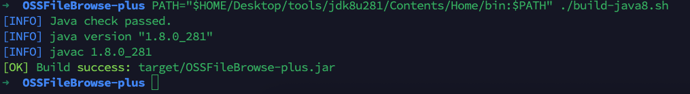
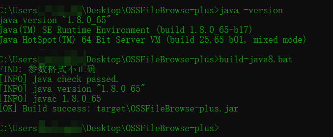

# OSSFileBrowse-plus

## 项目说明
`OSSFileBrowse-plus` 是用于存储桶资源浏览与预览的图形化工具，便于在授权场景中进行资源可访问性验证与取证展示。

## 致谢
本项目基于以下开源项目二次开发：  
`https://github.com/jdr2021/OSSFileBrowse`  
感谢原作者与贡献者的开源工作。

## 法律与安全声明
<span style="color:red;">本工具仅限**合法、合规、已授权**的安全测试与研究用途。</span>  
<span style="color:red;">严禁在未授权目标上使用；由此产生的一切后果由使用者自行承担。</span>

## 当前主要功能
- 存储桶资源加载与列表展示
- 资源搜索过滤
- 资源导出为 `txt`（仅完整 URL）
- 右键菜单：复制链接、复制预览链接、浏览器打开原始链接
- 代理配置（`NONE / SOCKS5 / HTTP` 三选一）
- 自定义请求头
- 图片直连预览与 kkFileView 预览
- 预览后缀可在界面动态配置

## 新增功能说明
- 异步加载：加载存储桶资源时采用异步任务，避免界面卡死。
- 全局代理：支持 `NONE / SOCKS5 / HTTP` 三选一代理模式。
- kkFileView 预览修复：统一预览 URL 生成规则，提升文档类文件预览稳定性。
- Header 头自定义：可在界面配置并应用自定义请求头。
- 导出资源 URL：左侧资源支持导出为 `txt`，每行一个完整 URL。
- 右键快捷操作：支持复制链接、复制预览链接、浏览器打开原始链接、同时支持搜索（便于检索后缀文件，快速定位敏感信息）。

## 界面展示


## 右键效果图


## 编译脚本效果图



## 运行方式
```bash
java -Dfile.encoding=UTF-8 -jar OSSFileBrowse-plus.jar
```

## Java8 编译脚本
- `build-java8.sh`（Linux/macOS）
- `build-java8.bat`（Windows）

说明：
- 脚本会先检查当前 `java`/`javac` 是否为 Java 8；
- 如果不是 Java 8，会直接终止编译；
- 编译成功后产物固定为：`target/OSSFileBrowse-plus.jar`。

## 配置项
配置文件：`src/main/resources/config.properties`

- `allow.extensions`: 允许纳入预览列表的后缀
- `image.extensions`: 作为图片直连预览的后缀
- `kkFileView_URL`: kkFileView 地址
- `proxy.type / proxy.host / proxy.port`: 统一代理配置
- `request.headers`: 默认请求头（`;` 分隔）

## 最后
如果该项目对你有帮助，给一个小小的star吧。